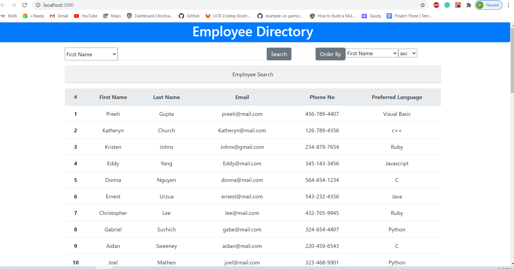

# User-Directory

The purpose of this project is to creat a employee directory with React. In this projcet we need to manage component state, and respond to user events. An employee or manager would benefit greatly from being able to view non-sensitive data about other employees.

## Getting Started

### Prerequisites

1. HTML
2. CSS
3. Javascript
4. React

## Details of the Project

In this application, user can view their entire employee directory at once and he can have quick access to their information.  We can filter the employee on the basis of name entered in the input field. And also sort it in ascending as well as descending order on the basis of firstName, lastName, email, preffered language. 

## My User-Directory Website Link ->  (https://preeti1234567.github.io/User-directory/)

## 

